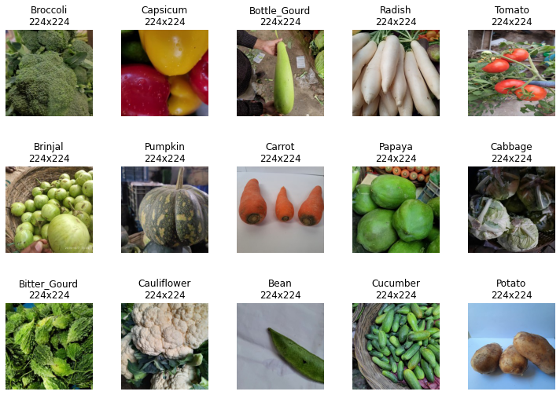
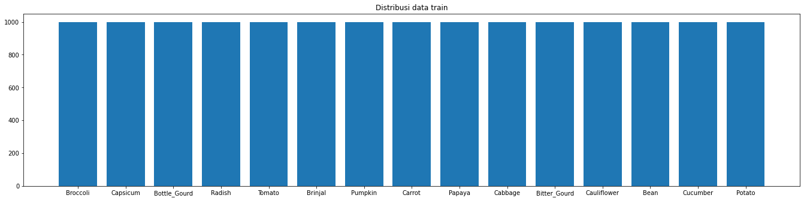
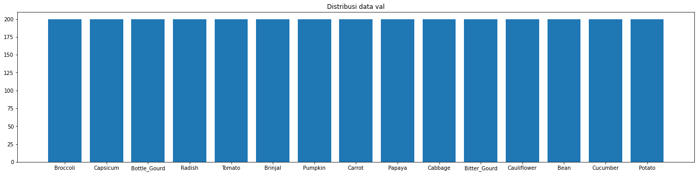
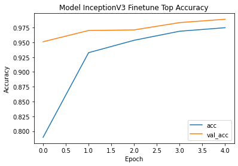
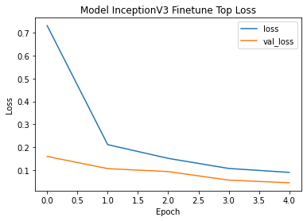
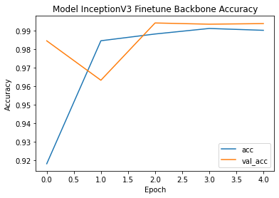
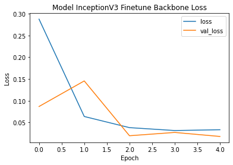

# Klasifikasi Sayur-mayur Menggunakan CNN dan Transfer Learning

Repository ini dibuat untuk memenuhi tugas mata kuliah JST Kelompok 4

## Latar Belakang

Convolutional Neural Network (CNN) adalah salah satu metode supervised learning yang telah terbukti sangat efektif untuk klasifikasi citra. Dikembangkan berdasarkan inspirasi dari organisasi dan struktur visual korteks otak manusia, CNN mampu mengenali pola kompleks dalam citra dengan tingkat akurasi yang tinggi.

CNN sangat cocok untuk klasifikasi citra karena memiliki beberapa fitur unik yang membuatnya efisien dalam mengatasi tantangan dalam pengolahan citra. Pertama, CNN memiliki lapisan konvolusi yang memungkinkan model untuk secara otomatis mengekstrak fitur-fitur penting dari citra, seperti tepi, sudut, dan tekstur, tanpa perlu fitur ekstraksi manual. Selain itu, CNN juga menggunakan lapisan pooling untuk mereduksi dimensi citra dan mengurangi jumlah parameter yang diperlukan untuk dilatih, sehingga mengurangi risiko overfitting.

Di sisi lain, metode Transfer Learning juga telah menjadi pendekatan populer dalam klasifikasi citra. Transfer Learning memanfaatkan pengetahuan yang telah dipelajari oleh model sebelumnya dalam tugas yang berbeda dan mentransfernya ke tugas klasifikasi citra baru. Pendekatan ini sangat efektif ketika dataset pelatihan terbatas atau ketika ingin menghemat waktu dan sumber daya dalam melatih model dari awal. Dengan Transfer Learning, pretrained model dapat digunakan sebagai titik awal yang kuat untuk mengklasifikasi citra baru, dan model dapat diadaptasi ke tugas klasifikasi citra tertentu melalui proses fine-tuning.

Dalam percobaan ini, kami akan melakukan klasifikasi citra menggunakan arsitektur CNN dan pretrained model. Kami akan memanfaatkan keunggulan CNN dalam ekstraksi fitur otomatis dan efisien, serta menggunakan Transfer Learning untuk memperoleh manfaat dari pengetahuan yang telah dipelajari sebelumnya. Dengan pendekatan ini, kami berharap dapat mencapai akurasi klasifikasi citra yang tinggi dan efisien dalam penggunaan sumber daya.

## Metodologi

Dataset yang digunakan ialah **Vegetable Image Dataset** yang tersedia di [Kaggle](https://www.kaggle.com/datasets/misrakahmed/vegetable-image-dataset)

Dataset terdiri atas 21000 citra berukuran seragam (uniform) 224x224 pixel dengan format .jpg yang **sudah di-split** train, test, dan validation. Dataset terdari dari 15 kelas, yaitu bean, bitter gourd, bottle gourd, brinjal, broccoli, cabbage, capsicum, carrot, cauliflower, cucumber, papaya, potato, pumpkin, radish dan tomato. 


Dataset dibagi dengan rincian sebagai berikut. 

- Data train berjumlah 15000 gambar (@1000)
  
- Data test berjumlah 3000 gambar (@200)
  
- Data validation berjumlah 3000 gambar (@200)
  

Citra juga melalui tahapan preproses data menggunakan ImageDataGenerator agar siap untuk di train. Objek datagen berfungsi untuk memproses data sebelum di load. Selain itu, penggunaan fungsi flow_from_directory akan membuat data ter-label-kan berdasarkan nama folder di mana ia tersimpan.


## Hasil Pengembangan Model CNN

Dalam mengembangkan model CNN, kita perlu berpatokan pada building block CNN. Ada tiga tipe lapisan pada CNN

- Lapisan Konvolusi atau Convolutional Layers +relu.
- Lapisan Pooling atau Pooling Layers.
- Lapisan Logika atau Fully-Connected Layers 

Pada percobaan ini, dibuat 3 model CNN dengan arsitektur yang beragam, sebagai berikut.

1. Arsitektur Model 1
   
   
   Nilai evaluasi untuk arsitektur 1 ini, yaitu:
   Test loss: 0.7480378150939941 
   Test acc: 0.753000020980835

2. Arsitektur Model 2
   
   
   Nilai evaluasi untuk arsitektur 2 ini, yaitu:
   Test loss: 0.8672617077827454 
   Test acc: 0.7106666564941406

3. Arsitektur Model 3
   
   
   Nilai evaluasi untuk arsitektur 3 ini, yaitu:
   Test loss: 0.2766130864620209 
   Test acc: 0.9150000214576721

model yang memiliki performa terbaik ialah Model 3 dengan nilai akurasi 0.917 untuk training dan 0.915 untuk testing. Arsitektur dari model ini, yaitu 

```textile
Convolutional Structure

- input shape (224, 224, 3)
- Conv2D 32 (3,3) padding='same', relu
- MaxPooling2D (2,2)
- Conv2D 32 (3,3) padding='same', relu
- MaxPooling2D (2,2)
- Dropout 0.2

Fully Connected Layer

- Flatten
- Dense 1024 relu
- Dropout 0.3
- Dense 15
```


## Hasil Pengembangan Model Transfer Learning

Transfer learning adalah metode yang memanfaatkan model yang sudah dilatih terhadap suatu dataset untuk menyelesaikan permasalahan lain yang serupa dengan cara menggunakannya sebagai starting point, memodifikasi dan mengupdate parameternya sehingga sesuai dengan dataset yang baru.

### Pretrained Model InceptionV3

Pada dataset yang kami pilih, kami akan menggunakan Model InceptionV3 yang sudah dilatih dengan dataset **imageNet** untuk melakukan klasifikasi sayur-mayur.

Pretrained model InceptionV3 ini dipilih karena model telah dilatih dengan data ImageNet yang mengandung data sayuran ([Sumber](https://deeplearning.cms.waikato.ac.nz/user-guide/class-maps/IMAGENET/)), seperti *broccoli, cauliflower, zucchini, cucumber, bell pepper*, dan lainnya. Karena InceptionV3 telah memiliki weight yang mempelajari features pada sayuran, maka wajar jika kita melakukan klasifikasi sayur mayur menggunakan InceptionV3 Imagenet.

### Finetune Top/Classifier

Melatih layer output/classifier dari model InceptionV3 sehingga sesuai dengan klasifikasi sayuran yang memiliki 15 kelas. Layer lainnya yang merupakan bawaan dari InceptionV3 akan dibekukan. Adapun grafik akurasi dan loss-nya terlihat sebagai berikut.



Nilai evaluasi dari model ini, yaitu:
Test loss: 0.0535241961479187 
Test acc: 0.9866666793823242

### Finetune Backbone Layer

Melatih beberapa layer terakhir dari pretrained model InceptionV3 dengan cara di unfreeze. Untuk layer lainnya tetap di-*freeze*. Layer yang di-unfreeze ialah layer-layer setelah layer 'mixed9'. Adapun grafik akurasi dan loss-nya terlihat sebagai berikut.



Nilai evaluasi untuk model ini, yaitu:
Test loss: 0.026630882173776627 
Test acc: 0.9919999837875366

Dengan menggunakan pretrained model InceptionV3 yang dilatih dengan data ImageNet, telah berhasil dilakukan klasifikasi terhadap dataset sayur-mayur. Nilai akurasi yang didapat, diantaranya:

- Untuk model dengan finetune classifier, akurasi validationnya 0.989 dan akurasi testnya 0.986
- Untuk model dengan finetune backbone, di mana layer setelah 'mixed9' di unfreeze, akurasi validationnya 0.994 dan akurasi testnya 0.992